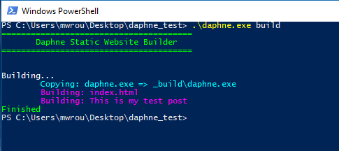

# Daphne 
 

Daphne is a portable tool that allows you to easily create static blogs. You define your content, pages, posts, and templates, and Daphne will combine everything into a complete website based on your specifications. Very similar to Jekyll, except Daphne removes some complexity.

## Getting Started 
Getting started with Daphne is easy, simply download [dist/daphne.exe](dist/daphne.exe), place it in the directory of your website, or somewhere else and link to it with your `PATH` environment variable, and use the following command to build your website: 
```text
.\daphne.exe build 
```
Or, if you want to build your website as you make changes: 
```text
.\daphne.exe watch 
```
Now, any time a file changes Daphne will rebuild your website!

### Starting From Nothing 
If you are starting with a completely blank project, run: 
```text
.\daphne.exe new 
```
And Daphne will create the default folder structure for you.

## Folder Structure 
A website build with Daphne has a very similar folder structure to websites using Jekyll 
```text
.
├── _config.daphne 
├── _includes/ 
|   └── page_header.html
├── _templates/
|   ├── default.html
|   └── post.html
├── _posts/
|   └── 2017-01-01-IntroducingDaphne.html 
├── assets/ 
|   ├── styles.css
|   └─ main.js
└── index.html
```
`_config.daphne` is your configuration file (see next section) 
Any blog posts you right go in `_posts/`.


## Configuration 
Daphne allows you to customize almost every aspect of the parser,  here is an example configuration (_config.daphne):
```text
site: { 
	url: http://example.com
	title: My Website 
	description: My personal website 
	author: John Doe 
}

blog: { 
	permalink: /blog/%slug%
	excerpt: <!-- more -->
}
```
You can name any parameters here that you may want to access from your files, just keep them to one line. 
 
Here are default ones given if they are not set: 
```text
compiler: { 
	source: .
	output: _build 
	template_dir: _templates 
	include_dir: _includes
	posts_dir: _posts 
}

blog: { 
	permalink: /blog/%slug%
	excerpt: <!-- more -->
}
```

## Importing Files
To import the contents of another file (from the `compiler.include_dir` folder) use the following command in your templates: 
```

```

## Control Structures 
Daphne offers two types of control structures to aid in altering pages. 

It is important to note that all commands that start with `` **have to be on their own line**, otherwise they will be rendered as plain text. 

### If Statement 
The first is the if statement, and is pretty standard 
```html

	<h1>Condition or anotherCondition is true</h1>

	<h1>Condition and anotherCondition are false</h1>

```

### Foreach Loop 
The `foreach` loop is the only loop that Daphne offers, and is for looping through pages or posts that your site has. 

```html

	<h1>
	This will happen for every post you have in the compiler.posts_dir folder 
	</h1>

```
```html

	<a href="#">Navigation link for every page on your website</a>

```
## Prints
Now, the most important thing, displaying information. 
```html
<h1>{{ page.title }} by {{ page.author }}</h1> 
```
You can have many print commands on the same line, unlike `if` and `foreach`

### Ternary Operator 
Daphne also supports a ternary operator 
```html
<h1>{{ (page.template == "post") ? "This is a blog post" : "This is not a blog post" }}</h1>
```
Anything in quotes is a string literal and the quotes will be removed. 

### Concatenation 
You can also concatenate strings: 
```html

```
Which is also the same thing as: 
```html

```
Similarly, this works with two variables 
```html

```

### Reserved Words 
The words `page` and `site` are reserved, so do not use them as the alias on your `foreach` loops. 

You can reference anything in your `_config.daphne` file by doing: 
```
{{ section.name }}
```
Page is used to reference the current page information. 


## Example Website 
This is our folder structure: 
```
.
├── _config.daphne 
├── _includes/ 
|   ├── page_footer.html
|   └── page_header.html
├── _templates/
|   └── default.html
├── _posts/
|   └── 2017-01-01-TestPost.html 
├── assets/ 
|   └─ styles.css
└── index.html
```
We have the following files: 
#### _config.daphne
```text 
site: { 
	title: Test Website
	description: My test website 
}
```
#### index.html 
```html
---
title: Home Page 
layout: default
description: Welcome to my home page
testVar: Noop 
---
Hello, thank you for visiting my homepage: 
 
	<h4>{{ post.title }}</h4>
	<p>Posted on {{ post.date }}</p><br/>
	<p>{{ post.excerpt }}</p>
	<a href="{{ post.url }}">Click here to read more</a>
	<br/>

```

#### _templates/default.html
```html
<!DOCTYPE html>
<html lang="en">
	<head>
		<title>{{ page.title }}</title>
		<meta name="description" content="{{ page.description }}">
	</head>
	<body>
		
		{{ content }}
		
	</body>
</html>
```

#### _includes/page_header.html
```html
<h1>{{ page.title }}</h1>
```
#### _includes/page_footer.html
```html
<h2>Bye! Thanks for visiting my website!</h2>
```

#### _posts/2017-01-01-TestPost.html
```html
---
title: This is my test post 
layout: default
---
Howdy! Isn't this just a wonderful test post! 
<!-- more --> 
Look, now you are reading more!

Thanks!
```

## Built Example Website


When you build this website, you will get the following new folder: 
```
.
|── _build/
|     ├── index.html
|     ├── blog/
|           ├── this-is-my-test-post/
|    		   └── index.html
```
Here is what each file would look like: 
#### _build/index.html
```html
!DOCTYPE html>
<html lang="en">
	<head>
		<title>Home Page</title>
		<meta name="description" content="Welcome to my home page">
	</head>
	<body>
<h1>Home Page</h1>
Hello, thank you for visiting my homepage:
	<h4>This is my test post</h4>
	<p>Posted on January 1, 2017</p><br/>
	<p>Howdy! Isn't this just a wonderful test post!</p>
	<a href="blog/this-is-my-test-post/">Click here to read more</a>
	<br/>
<h2>Bye! Thanks for visiting my website!</h2>
	</body>
</html>
```
#### _build/blog/this-is-my-test-post/index.html
```html
!DOCTYPE html>
<html lang="en">
	<head>
		<title>This is my test post</title>
		<meta name="description" content="My test website">
	</head>
	<body>
<h1>This is my test post</h1>
Howdy! Isn't this just a wonderful test post!
<!-- more -->
Look, now you are reading more!

Thanks!
<h2>Bye! Thanks for visiting my website!</h2>
	</body>
</html>
```
